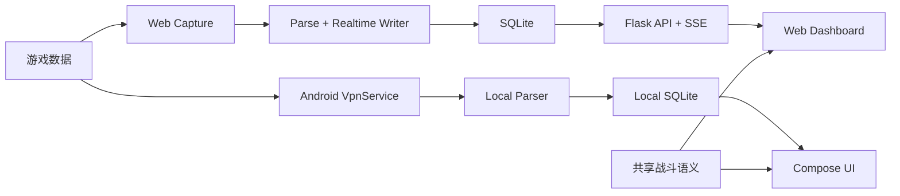

<div align="center">

# stzb_watcher

### 《率土之滨》Web + Android 双端战场数据平台

从本地战场数据采集到态势研判、队伍研究、团队管理与战斗模拟，
Web 与 Android 使用一致的数据口径和业务语义，覆盖同一套核心能力。


[产品预览](#产品预览) · [核心能力](#核心能力) · [快速开始](#快速开始) · [常用功能](#常用功能) · [完整使用文档](docs/USER_GUIDE.md) · [项目结构](#项目结构)
</div>

---
## 问题反馈：QQ群 1063894809

## 双端产品

`stzb_watcher` 将战场采集、实时部队、战报分析、玩家队伍、团队协作、积分考勤、
阵容研究与战斗模拟整合为一套本地优先的数据平台。

| Web | Android |
|---|---|
| 面向桌面宽屏的高密度指挥与多面板分析 | 面向移动设备的触控操作与本机运行 |
| Flask API、SSE 与浏览器仪表盘 | VpnService、本地解析、SQLite 与 Compose |
| 适合持续监控、横向比较与团队管理 | 适合随身采集、快速查看与移动决策 |

两端的差异只在交互载体和运行方式。核心数据模型、业务口径、阵容语义与模拟结果
保持一致，不区分主端与次端。

## 产品预览

### Web 全景


战场情报将全域地图、图层控制、风险态势和情报详情收拢到同一个宽屏工作区。

## 核心价值

| 场景 | 能力 |
|---|---|
| 战场态势统一 | 将地图格子、行军、实时部队、战报与世界事件汇聚到同一视图 |
| 实时行动判断 | 追踪部队位置、路线、目标、新鲜度与阵容证据，减少信息切换 |
| 阵容研究推演 | 结合历史样本、武将战法资料与 Kotlin 战斗引擎验证对阵方案 |
| 团队协同管理 | 统一查看成员队伍、团数据、攻城考勤、自定义积分与赛季表现 |
| 本地数据闭环 | Web 与 Android 均可在本地完成采集、解析、存储与查询 |

## Web 功能画廊

<table>
  <tr>
    <td width="50%" align="center">
      <br>
      <strong>实时部队</strong><br>
      聚合位置、路线、目标和精确战报阵容，形成三栏指挥视图。
    </td>
    <td width="50%" align="center">
      <br>
      <strong>战斗模拟</strong><br>
      配置攻守阵容，执行单场或批量推演，并查看语义事件回放。
    </td>
  </tr>
  <tr>
    <td width="50%" align="center">
      <br>
      <strong>阵容战法研究</strong><br>
      连接历史对阵、战法执行链与模拟结果，验证阵容思路。
    </td>
    <td width="50%" align="center">
      <br>
      <strong>自定义积分</strong><br>
      按赛季规则计算榜单，支持筛选、调整、重算与规则管理。
    </td>
  </tr>
  <tr>
    <td width="50%" align="center">
      <br>
      <strong>打城考勤</strong><br>
      管理任务阶段、成员安排与攻城出勤，统一团队执行记录。
    </td>
    <td width="50%" align="center">
      <br>
      <strong>玩家队伍</strong><br>
      按玩家、同盟和攻守侧查看常用阵容、战法与实战表现。
    </td>
  </tr>
</table>

## Android 产品预览

截图文件名、尺寸与替换约定见
[`docs/assets/screenshots/README.md`](docs/assets/screenshots/README.md)。

<table>
  <tr>
    <td width="33%" align="center">
      
    </td>
    <td width="33%" align="center">
      
    </td>
    <td width="33%" align="center">
      
    </td>
  </tr>
  <tr>
    <td align="center"><strong>战场总览</strong><br>查看与 Web 一致的战场动态、筛选和状态信息。</td>
    <td align="center"><strong>队伍与团队</strong><br>访问同一套玩家队伍、成员统计与团队业务数据。</td>
    <td align="center"><strong>战斗模拟</strong><br>复用一致的阵容配置、战斗语义与推演能力。</td>
  </tr>
</table>

[截图资产说明](docs/assets/screenshots/README.md)

## 核心能力

| 能力域 | 主要能力 | Web | Android |
|---|---|:---:|:---:|
| 战场 | 战场情报、地图格子、行军、实时部队、世界事件 | 支持 | 支持 |
| 战报 | 完整战报、详情、筛选、通知与衍生统计 | 支持 | 支持 |
| 队伍 | 玩家队伍、同盟成员队伍、武将阵容与表现 | 支持 | 支持 |
| 团队 | 团数据、成员管理、打城考勤、自定义积分 | 支持 | 支持 |
| 分析 | 排行、州郡分布、阵容研究与对阵证据 | 支持 | 支持 |
| 模拟 | 双方配置、批量推演、结果与事件回放 | 支持 | 支持 |
| 系统 | 本地采集、SQLite、多档案、导出与设置 | 支持 | 支持 |

Web 侧重宽屏指挥密度和多区域联动；Android 侧重移动交互、本机抓包和离线访问。

## 功能总览

Web 的 12 个主导航页面按五个业务域组织：

| 业务域 | 页面 |
|---|---|
| 情报 | 战场情报、实时部队 |
| 行动 | 玩家队伍、打城考勤、州郡分布 |
| 组织 | 同盟成员队伍、团数据、自定义积分 |
| 分析 | 武将阵容、阵容战法研究、战斗模拟 |
| 系统 | 设置中心 |

Android 一级导航为“战场、队伍、团队、模拟、更多”，以移动端结构承载同一套业务
能力和本地数据。

## 快速开始

### Android 普通用户

普通用户不需要下载源码，也不需要自己编译 APK。请按下面的路径下载正式安装包：

1. 打开项目的 [Releases 页面](https://github.com/GRQ02200059/stzb_watcher/releases)。
2. 进入最新版本，展开 `Assets`。
3. 点击 `app-release.apk` 下载。
4. 下载完成后，在手机文件管理器或浏览器下载列表中点击 APK 安装。
5. 如果系统提示限制安装未知应用，请允许当前文件管理器或浏览器安装应用。

下载时请注意：

- 不要点击 `Source code (zip)` 或 `Source code (tar.gz)`，它们是项目源码；
- 不要把 `app-debug.apk` 作为正式安装包；
- 如果同时存在 `app-release-unsigned.apk`，请优先选择已签名的 `app-release.apk`；
- 当前 Android 版本要求为 Android 13 及以上，主要支持 `arm64-v8a` 和 `armeabi-v7a`。

#### Android 首次使用

1. 打开 `st助手安卓独立版`。
2. 进入底部导航的 `更多`。
3. 点击 `抓包启动台`。
4. 点击 `搜索并选择 App`，选择需要采集的游戏 App。
5. 点击 `启动抓包`，按系统提示确认 VPN 权限。
6. 切换到游戏，执行登录、打开地图、查看战报等联网操作。
7. 返回 App，查看 `STZB 解析日志`。
8. 回到 `战场`、`战报`、`队伍`、`地图与城池` 等页面查看采集结果。

使用结束后，回到 `抓包启动台` 点击 `停止抓包`。

### Windows 普通用户

如果你使用 Windows，不需要安装 Python 或配置开发环境，可以直接使用 Release 中的 EXE：
0. 下载npcap服务。https://npcap.com/
1. 打开项目的 [Releases 页面](https://github.com/GRQ02200059/stzb_watcher/releases)。
2. 进入最新版本，展开 `Assets`。
3. 下载文件名以 `.exe` 结尾的 Windows 程序。
4. 如果下载的是压缩包，先完整解压到本地文件夹。
5. 双击运行 EXE；如果 Windows Defender 弹出提示，请确认文件来源后选择允许运行。
6. 如果程序没有自动打开浏览器，手动访问 [http://127.0.0.1:8080](http://127.0.0.1:8080)。

使用时请保持 EXE 进程运行。关闭程序窗口或结束进程后，本地 Web 服务也会停止。首次运行建议把程序放在具有读写权限的普通文件夹中，不要直接放在需要管理员权限的系统目录。

下载时请注意：

- Windows 用户下载 `Assets` 中的 `.exe` 文件，不要下载 `Source code` 源码压缩包；
- 如果 Release 同时提供多个 EXE，优先选择标注为 Windows、release 或正式版本的文件；
- Windows 版和 Android APK 是两种不同的安装包，不要把 `.exe` 文件传到手机安装。

### Web 普通用户（源码启动）

Web 端运行在电脑本地，启动后使用浏览器访问。

启动命令：

```bash
python api_server.py
```

然后打开：

```text
http://127.0.0.1:8080
```

首次使用建议：

1. 确认顶部连接状态正常。
2. 在顶部账号下拉框选择正确的角色/区服档案。
3. 进入 `战场情报` 查看态势地图。
4. 进入 `实时部队` 查看当前行军、玩家和目标。
5. 进入 `战报`、`玩家队伍` 或 `同盟成员队伍` 查看历史数据。
6. 需要研究阵容时，依次使用 `武将阵容`、`阵容战法研究` 和 `战斗模拟`。

如果 Web 页面显示为空，请先启动游戏数据采集，在游戏中执行联网操作，再点击页面中的刷新按钮。

### 开发者构建方式

#### Web

环境要求：

- Python 3.9+
- JDK 17
- 支持现代 JavaScript、Canvas 与 SSE 的 Chrome 或 Chromium 浏览器

```bash
git clone <your-repository-url>
cd stzb_watcher

python3 -m venv .venv
source .venv/bin/activate
pip install -r requirements.txt

./gradlew -p battle-engine test installDist
python api_server.py
```

如果服务需要被局域网中的其他设备访问，建议保护写接口：

```bash
export STZB_API_TOKEN='请替换为随机长字符串'
python api_server.py
```

#### Android

环境要求：

- Android Studio 或命令行 Android SDK
- Android SDK 35
- Android 13+（`minSdk 33`）
- JDK 17
- NDK `26.3.11579264`，用于构建本机 VPN/SOCKS5 桥接

```bash
cd astzb
bash check_android_env.sh
./gradlew :app:assembleDebug
```

Debug APK 生成于：

```text
astzb/app/build/outputs/apk/debug/app-debug.apk
```

正式出包请使用：

```bash
cd astzb
./build_release_apk.sh
```

正式 APK 生成于：

```text
astzb/app/build/outputs/apk/release/app-release.apk
```

## 常用功能

### Android 页面

| 入口 | 用途 |
|---|---|
| 战场 | 实时事件 Feed、分类筛选、暂停/恢复和新事件提示 |
| 队伍 | 按玩家、同盟、武将或战法搜索队伍，查看胜率和战报表现 |
| 团队 | 按周期、分组或成员查看团队报表，并导出 CSV |
| 模拟 | 配置攻守双方阵容，运行单场或批量战斗模拟 |
| 更多 → 战报 | 查看完整战报并进入详情 |
| 更多 → 同盟成员 | 查看同盟成员与分组 |
| 更多 → 地图与城池 | 查看地图格子、城池和类型统计 |
| 更多 → 排行榜 | 查看玩家武勋、同盟武勋和势力排行 |
| 更多 → 抓包启动台 | 选择目标 App、启动/停止抓包、查看日志和导出数据 |

### Web 页面

| 页面 | 用途 |
|---|---|
| 战场情报 | 态势地图、实时行军、活跃部队、协议实体和证据时间线 |
| 实时部队 | 按部队 ID、玩家、武将或 WID 搜索实时部队 |
| 玩家队伍 | 查看玩家常用阵容、攻守侧、战法和实战表现 |
| 同盟成员队伍 | 按分组查看同盟成员队伍和胜率 |
| 打城考勤 | 创建攻城任务，统计成员出战情况并导出 CSV |
| 团数据 | 按周期、分组或成员查看战斗、攻城和武勋统计 |
| 自定义积分 | 配置规则、调整成员积分、预览并重算榜单 |
| 武将阵容 | 统计三人组合的出战次数、胜负和平衡胜率 |
| 阵容战法研究 | 区分配置事实、历史统计和模拟验证 |
| 战斗模拟 | 使用 Kotlin 战斗引擎运行单场或批量推演 |
| 州郡分布 | 查看各州人数、势力、同盟和分组分布 |
| 设置中心 | 设置自动刷新、信息密度、动效、声音提醒和运行链路 |

## 导出与排障

Android 在 `更多 → 抓包启动台 → 导出与兼容` 中支持：

- `导出解析包`：导出识别到的 STZB 应用层解析结果；
- `导出数据库`：导出本机 SQLite 数据库；
- `导出诊断`：导出消息计数、协议分布和近期包预览。

常见问题：

- **APK 下载哪个？** 下载 Release 页面 `Assets` 中的 `app-release.apk`，不要下载源码压缩包。
- **Windows 下载哪个？** 下载 Release 页面 `Assets` 中以 `.exe` 结尾的 Windows 程序。
- **Windows EXE 启动后怎么看页面？** 优先等待程序自动打开浏览器；如果没有打开，访问 `http://127.0.0.1:8080`。
- **Android 安装失败？** 确认设备是 Android 13+，且 APK 与 ARM ABI 匹配。
- **Android 没有数据？** 检查目标 App、VPN 授权、抓包状态，并在游戏中执行联网操作。
- **Web 打不开？** 确认已运行 `python api_server.py`，然后访问 `http://127.0.0.1:8080`。
- **Web 数据为空？** 启动采集后执行游戏操作，再刷新当前页面。

完整的安装、抓包、导出、Token、隐私和故障排查说明请查看：

[Web + Android 完整使用文档](docs/USER_GUIDE.md)

Android 工程细节请查看：

[Android 用户指南](astzb/USER_GUIDE.md) · [Android 出包指南](astzb/BUILD_RELEASE.md)

## 数据与隐私

本项目采用本地优先的数据策略：

- Web 原始数据默认写入 `capture_new/`，业务数据保存在本地 SQLite；
- Android 数据保存在 App 私有目录中的本地 SQLite，并支持本机导出；
- `current_profile.json` 与 `profiles.json` 可能包含角色、区服和本机路径；
- 数据库、运行态账号文件、日志和抓包文件均不应提交到 Git；
- 上传 README 截图前，请自行检查并遮挡不希望公开的账号信息；
- 对外或局域网部署 Web 服务时，应设置 `STZB_API_TOKEN`。

## 技术架构



| 层级 | 技术 |
|---|---|
| Web | Python、Flask、SQLite、Vanilla JavaScript、Canvas、SSE |
| Android | Kotlin、Jetpack Compose、VpnService、SQLite、NDK |
| 实时链路 | Scapy / SOCKS5 捕获、报文解析、增量写入 |
| 战斗能力 | Kotlin/JVM 17 战斗引擎与一致的模拟语义 |

进阶设计与调研资料：

- [设计规格](docs/superpowers/specs/)
- [实施计划](docs/superpowers/plans/)
- [协议与迁移调研](docs/research/)

## 项目结构

```text
stzb_watcher/
├── api_server.py             # Web 服务、API 与启动入口
├── scrapy_v2.py              # Web 抓包与报文解析
├── realtime_writer.py        # 实时写库与事件推送
├── static/                   # Web 产品页面与前端资源
├── intelligence/             # 战场情报与阵容分析
├── score_center/             # 赛季积分业务
├── world_scene/              # 世界场景读模型
├── battle-engine/            # Kotlin 战斗引擎运行镜像
├── astzb/                    # Android 客户端
├── data/intelligence/        # 版本化情报快照
├── docs/                     # 设计、计划、调研与截图说明
└── test/                     # Node、Python 与 Chrome 测试
```

## 验证

Web 前端与纯逻辑测试：

```bash
node --test test/js/*.test.mjs
```

Python API、数据模型、静态契约与系统 Chrome E2E：

```bash
PYTHONPYCACHEPREFIX=/private/tmp/stzb-pycache \
  .venv/bin/python -m unittest discover -s test -v
```

Android 单元测试与构建：

```bash
cd astzb
./gradlew testDebugUnitTest :app:assembleDebug
```

## 许可与联系

本项目按 MIT License 使用。项目用于个人学习与团队内部数据管理，请遵守适用法律、
游戏服务条款与数据隐私要求。


